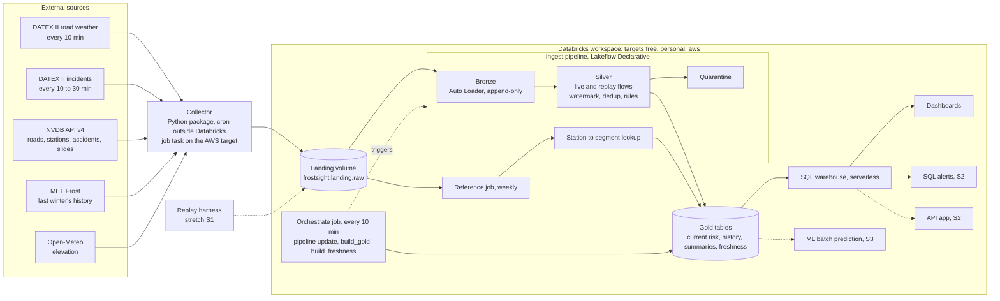
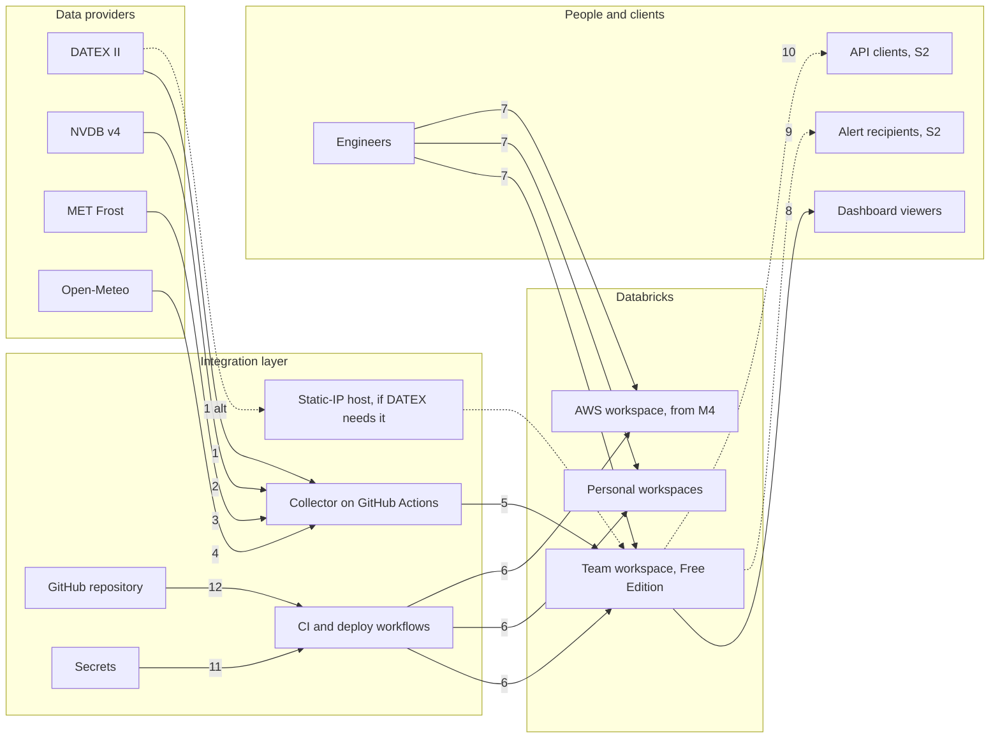

# Architecture

The detailed diagrams are in [`architecture.html`](architecture.html). Screen mock-ups are in
[`screens.html`](screens.html). Decisions are recorded in [`adr/`](adr/).

## Data flow

Three rules shape the design:

1. **Anything that calls an external URL lives in `collector/`.** Free Edition restricts outbound internet
   from notebooks and jobs, so the collector runs outside Databricks and writes files into the landing
   volume. On the AWS target the same code can run as a job task. Pipelines and jobs read only the
   landing volume and Unity Catalog tables.
2. **Same code on every target.** Everything is serverless. Target differences are bundle variables.
   See [`plan/00_README.md`](plan/00_README.md) section 2 and [`platform-targets.md`](platform-targets.md).
3. **One pipeline, one serial job.** Free Edition allows one active pipeline and five concurrent job tasks
   per account. Bronze, both silver flows, quarantine and the lookup share the ingest pipeline. Replay
   files use the same folders and reach silver through their own flow with their own watermark.

## Integrations

| # | From → to | Protocol and format | Authentication | Cadence | When |
|---|---|---|---|---|---|
| 1 | DATEX II → collector | HTTPS GET pull snapshot, XML, flattened to JSON lines | Basic auth from a free account; the form asks for a fixed IP or DNS name | 10 min road weather, 10 to 30 min incidents | M0 register, M2 live |
| 2 | NVDB v4 → collector | HTTPS REST, JSON, paged through `metadata.neste` | `X-Client` header, no key | Weekly | M1 |
| 3 | MET Frost → collector | HTTPS REST, JSON, chunked by month | Client ID | Once, for last winter | M1 |
| 4 | Open-Meteo → collector | HTTPS, JSON, up to 100 points per call | None | Once | M1 |
| 5 | Collector → landing volume | Databricks Files API through the Python SDK | Workspace token on Free Edition, service principal on AWS | Every 30 min | M2 |
| 6 | CI → workspaces | `databricks bundle validate` and `deploy` | User token on Free Edition, service principal OAuth on AWS | Every pull request and merge | M2, M4 for AWS |
| 7 | Engineers → workspaces | Databricks CLI, Git folders, `bundle deploy -t personal` | OAuth user login per CLI profile | While developing | M0 |
| 8 | Dashboards → viewers | AI/BI dashboards on the SQL warehouse | Workspace login, `CAN_READ` | Refreshes with the 10-minute job | M6 |
| 9 | Alerts → recipients | SQL alerts, email | Notification destination | After each job run | S2 |
| 10 | API → clients | Databricks App, HTTPS JSON | App login; the app's service principal reads gold | On request, 60-second cache | S2 |
| 11 | Secrets → CI and collector | Environment variables and a secret scope | DATEX account, Frost client ID, workspace token | Each run | M0 |
| 12 | Repository → CI | GitHub Actions on push and pull request | GitHub token | Every push | M2 |

Endpoint details and the live checks behind them are in [`source-verification.md`](source-verification.md).
The machine-readable inventory is [`config/sources.yml`](../config/sources.yml).
